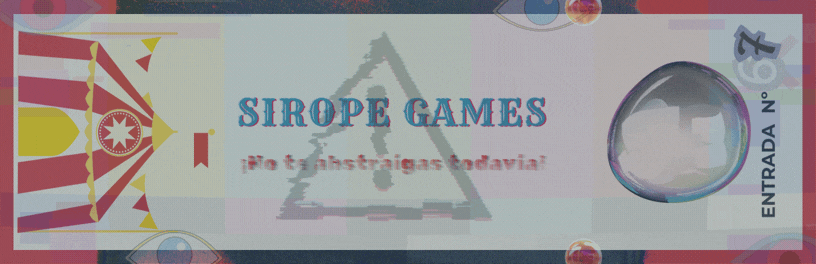
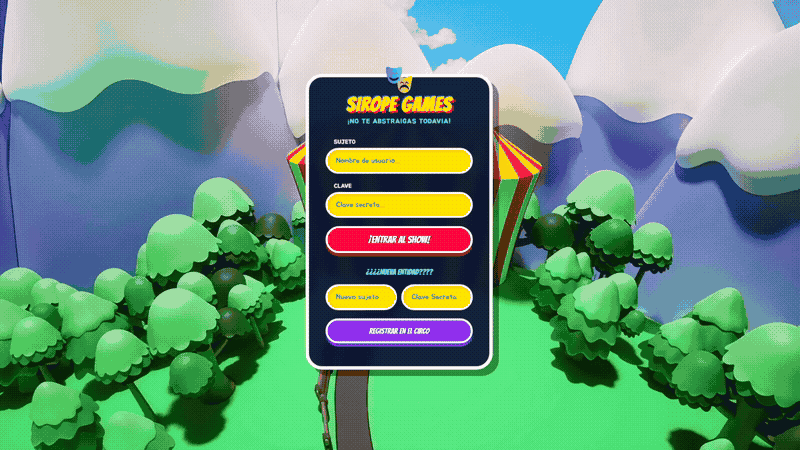
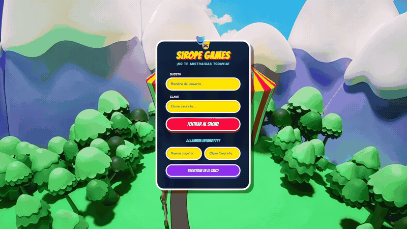
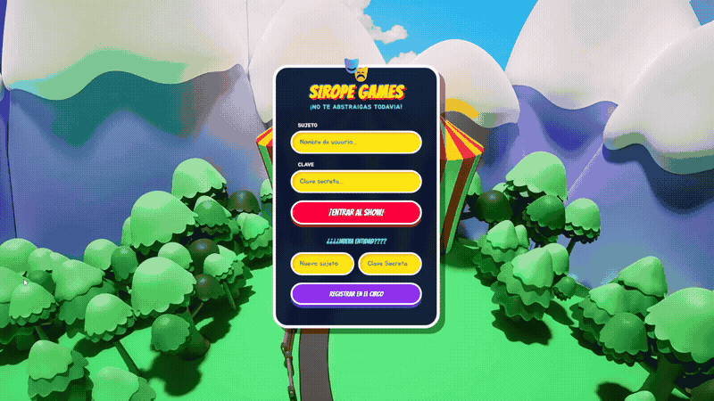
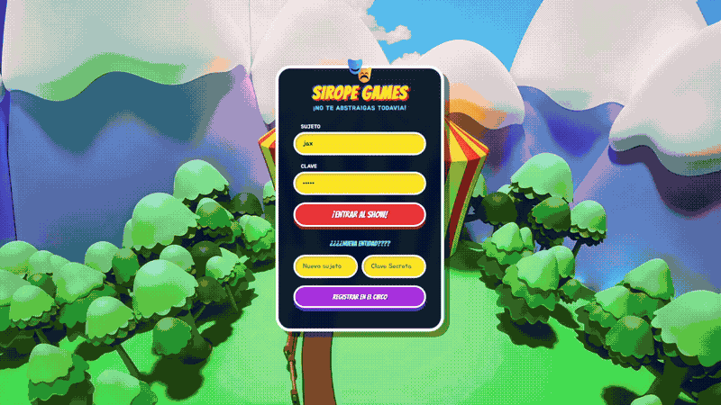
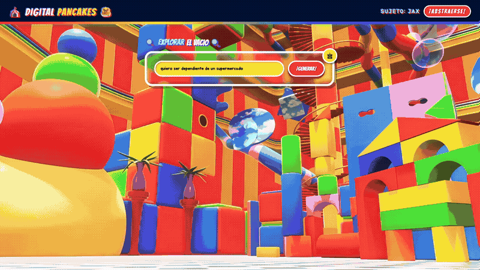
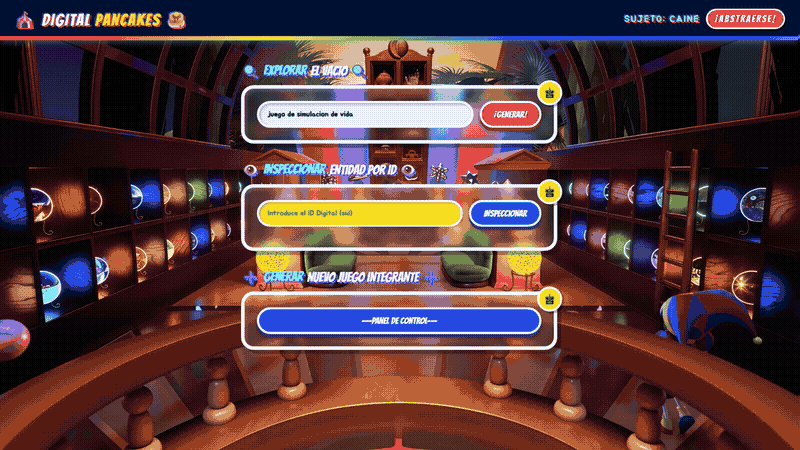
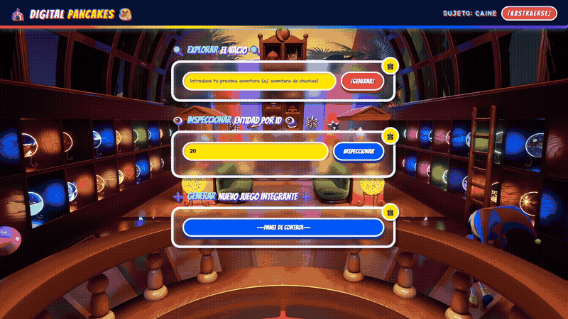
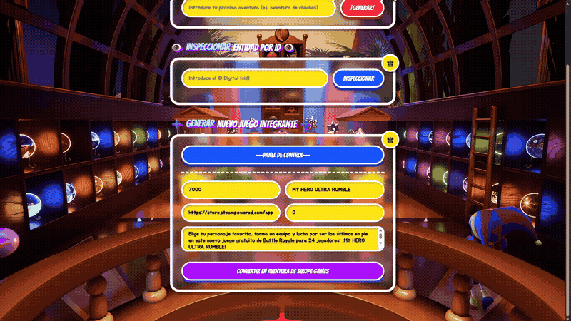
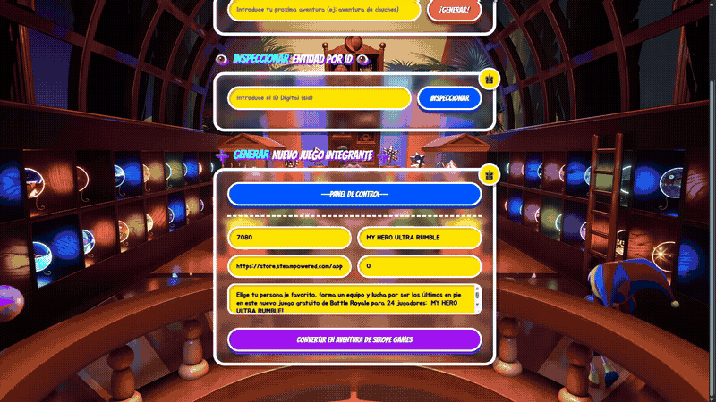

# Sirope Games

---

### *Motor de recomendación de videojuegos basado en IA.*

### Descripción del proyecto
Sirope Games es un backend desarrollado en Java con Spring Boot que expone una API REST para gestionar un catálogo de videojuegos y ofrecer recomendación personalizadas. El sistema utiliza RAG con embeddings generados por Ollama y almacenados en MongoDB Atlas Vector Search, combinado con el algoritmo de similitud coseno para calcular la afinidad entre la búsqueda del usuario y los prodcutos del catálogo.
El acceso al servicio de recomendaciones está protegido mediante JWT(JSON Web Tokens), implementado con la biblioteca Jose4J.

## Características

### Bases de datos separadas

Por motivos de seguridad, la gestión de usuarios y el almacenamiento de juegos se hace de forma separadas.
- MongoDB Atlas: Almacenamiento de juegos en base de datos documental para su fácil recuperación y gestión. Al existir en la nube se puede separar de los contenedores Docker facilitando así el despliegue de instancias locales.
- PostgreSQL: Base de datos relacional para el almacenamiento de usuarios en local, encriptando las contraseñas en el proceso.

### Docker

El uso de docker hace el despliegue de la aplicación sencillo y replicable.

Antes de levantar el proyecto, necesitarás tener instalado en tu sistema:
- Docker Desktop (4.67.0) -> No es obligatorio, pero te proporcionará una interfaz gráfica para la gestión de los contenedores.
- Docker Compose (5.1.3) -> Necesario para el funcionamiento, con uso mediante linea de comandos (sin interfaz gráfica).

#### Intrucciones para su uso

git clone https://github.com/StarlightAura/tortitasConSirope.git

cd tortitasConSirope

docker compose up --build

docker compose down

### Ollama

---

Uso de Ollama para vectorización de documentos de MongoDB, permitiendo así la creación de algoritmos de similitud entre la búsqueda del usuario y 
los juegos de la base de datos.
En nuestro programa Ollama actúa como un traductor, donde su trabajo consiste en leer las descripciones de los videojuegos y convertirlas en una 
lista de embedding, que representará el significado real y el contexto del juego para la IA.

Por ello, cuando un usuario busca un juego con sus propias palabras, el programa no busca letras exactas, si no que traduce la frase 
del usuario a esos mismos embedding y los compara con los juegos de MongoDB usando el algoritmo de similitud coseno, 
encontrando los títulos que mejor se adaptan a lo que el usuario quiere.

### Thymeleaf

---

Como extra hemos incorporado al sistema una interfaz de web dinámica desarrollada con **Thymeleaf**. Esta capa de presentación se concibio 
como una oportunidad de explorar la UX, tomando como insipiración directa la serie de animación **The Amazing Digital Circus**.

Esta decisión estética y narrativa no es casual, sino que se fundamenta en un paralelismo con el propio lore de la serie.
En la serie un grupo de humanos interactúa dentro de un entorno virtual cerrado y caótico, donde las reglas y la realidad
son moldeadas por el control absoluto del director de circo, Caine, el cual es una Inteligencia artificial.

En nuestro programa se lleva una dinámica similar, ya que el usuario navega por una interfaz web aparentemente normal, pero
cuyas entrañas y flujos de información están gobernados y transformados en tiempo real por modelos locales de IA.

Integrar esta analogía gráfica en el motor de plantillas de Thymeleaf nos permitió demostrar por una parte la admiración
a esta obra, y por otra parte crear un entorno más amigable y accesible para el usuario.

#### Pantalla de acceso (Login y Registro)

Esta es la puerta de entrada a la aplicación, cuyo diseño se centraliza tanto el inicio de sesión como el registro de nuevos usuarios en la
misma pantalla para que el flujo sea lo más cómodo posible.

#### *Registro*

---

#### *Login*

---

Para garantizar la seguridad y coherencia visual de ejecución, la interfaz de segmenta según los privilegios del usuario autenticado en la sesión HTTP.

#### Login con User

Esta interfáz se basa en una barra de navegación que contiene a la izquierda el nombre de nuestro programa, el nombre de usuario a la derecha y dos únicas opciones con  las que interactuar,
una barra para pedir recomendaciones y un botón junto al nombre para abstraerse (logout).
Para las recomendaciones el usuario no necesita estructurar una consulta rígida, puede ser una descripción más libre y abierta a interpretación.

Tras enviar la petición, Ollama recoge la cadena de texto y busca la distancia conseno en la base vectorial de MongoDB Atlas y devuelve en pocos segundos
las 5 sugerencias con mayor afinidad.

#### Login con Admin

Si el sistema detecta un inicio de sesión con privilegios de Admin, la plantilla de Thymeleaf inyecta y desbloquea los paneles de gestión
avanzada en la zona inferior de la pantalla, justo después de las recomendaciones, manteniendolos completamente invisibles para los usuarios comunes.

Lo primero es otra barra de busqueda, que se encarga de encontrar registros mediante sus ID, permitiendo al administrador ver los datos exactos de un 
juego almacenado en MongoDB Atlas.

Lo segundo sería el panel de inserción de juegos, que consiste en un formulario cuyo trabajo es registrar un nuevo juego en MongoDB Atlas y hacer que la IA
calcule y añada su embedding.

### JWT

Para gestionar la seguridad del sistema, se ha implementado un mecanismo de autenticación basado en tokens JWT. 
Cuando un usuario inicia sesión correctamente, el servidor genera un token firmado digitalmente que actúa como una credencial temporal. 
A partir de ese momento, el cliente incluye este token en cada petición HTTP, lo que permite al backend verificar la identidad y los permisos 
del usuario de forma inmediata y sin necesidad de almacenar sesiones activas en la memoria del servidor.

Para la implementación técnica y el cifrado de estos tokens, se ha utilizado la biblioteca Jose4J. Esta librería especializada en Java gestiona 
de forma segura todas las operaciones criptográficas, encargándose de la generación, firma y validación de los JWTs. Su uso garantiza la integridad 
del sistema, impidiendo cualquier intento de falsificación de credenciales o de escalada de privilegios no autorizada (como la manipulación del rol
de usuario a administrador).Al basarse en el estándar HTTP, este sistema de seguridad protege de manera idéntica tanto la navegación web a través de Thymeleaf 
como el consumo directo de los endpoints mediante clientes de API REST como Postman.

### Postman

Script de Postman para la verificación de la funcionalidad correcta del programa.

| Endpoint                                                       | Descripción                                 |
|----------------------------------------------------------------|---------------------------------------------|
|http://localhost:8787/api/auth/signin                          | Login exitoso y obtención del token         |
|http://localhost:8787/api/recommendations?product=dark%20souls | Fallo sin token                             
|http://localhost:8787/api/products    | Inserción de producto con vectorización, usando token válido |
|http://localhost:8787/api/recommendations?product=dark%20souls  | Recomendaciones con token válido            |

#### Cómo importar y ejecutar
1. Abrir Postman.
2.File -> Import -> seleccionar el archivo .json de la carpeta postman-tests.
3.Ejecutar los tests en orden.

### Spring Boot

Compartimentalización de procesos dentro del programa.

### Algoritmo de similitud coseno.

Algoritmo de búsqueda entre documentos vectorializados.

### En memoria del Bot de Telegram
En las fases iniciales del proyecto, se diseñó e implementó un bot interactivo en Telegram bajo el usuario @SiropeGamersBot. 
El objetivo era ofrecer una vía alternativa y accesible para que los usuarios interactuaran con nuestro motor de 
recomendaciones de forma más dinámica. El bot estaba preparado para responder a los siguientes comandos básicos:
            
| Comando   | Descripción  |
|---|---|
| /start  |Muestra los comandos disponibles   |
| /registro  | Crear una cuenta nueva  |
| /login   | Iniciar sesión y obtener token  |
|/recomendar <juego>   | Pedir recomendaciones (requiere login)  |

Sin embargo, al analizar la infraestructura, descubrimos que los comandos de registro y login obligaban al usuario a escribir sus credenciales
de acceso en texto plano dentro del chat de Telegram, exponiendo la contraseña. Además, al no tener control sobre el propio Telegram,
no existía una forma segura de almacenar el token JWT en el dispositivo del usuario para adjuntarlo en las cabeceras
de cada petición HTTP. Por tanto, se optó por prescindir del bot, no sin antes dejar constancía de su breve existencia en nuestro proyecto.

#### Momentos humildes

---
